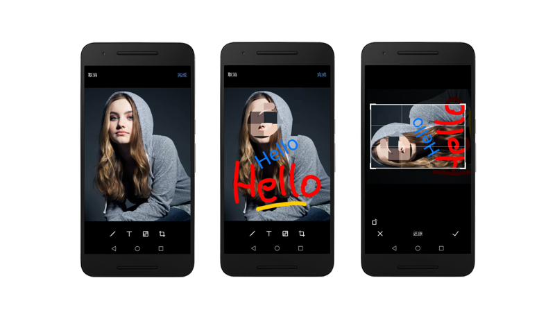
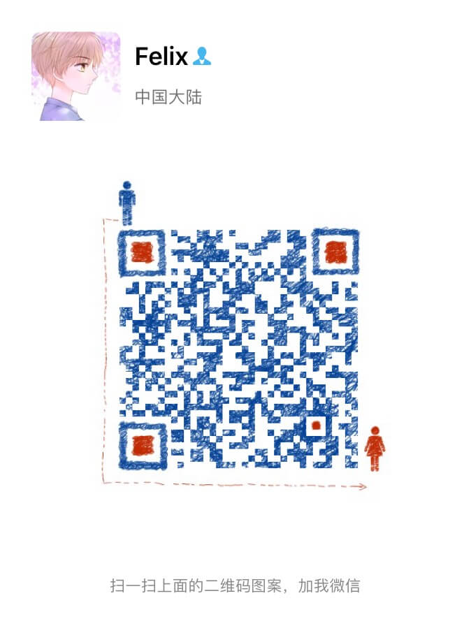

# Imaging

一款图片编辑类库，功能类似微信中图片编辑功能，其主要目标用于聊天中快速编辑图片。



包含以下主要功能：

- 缩放
- 涂鸦
- 文字
- 马赛克
- 裁剪
- 旋转

# Usage

``` gradle
implementation project(':image')
```

参考Sample示例

# Sample

``` kotlin
fun onChooseImages(uri: Uri, saveToPath: String) {
   startActivityForResult(
           Intent(this, IMGEditActivity::class.java)
                   .putExtra(IMGEditActivity.EXTRA_IMAGE_URI, image.uri)
                   .putExtra(IMGEditActivity.EXTRA_IMAGE_SAVE_PATH, saveToPath),
           REQ_IMAGE_EDIT
   )
}

override fun onActivityResult(requestCode: Int, resultCode: Int, data: Intent?) {
    when (requestCode) {
        REQ_IMAGE_EDIT -> {
            if (resultCode == Activity.RESULT_OK) {
                onImageEditDone()
            }
        }
    }
}

fun onImageEditDone() {
	// TODO do some thins
}
```

# Blog

- [Android 图片编辑的原理与实现——涂鸦与马赛克](https://mp.weixin.qq.com/s/rIGGSFua-HPmUL4citYxow)

# About

我的微信
